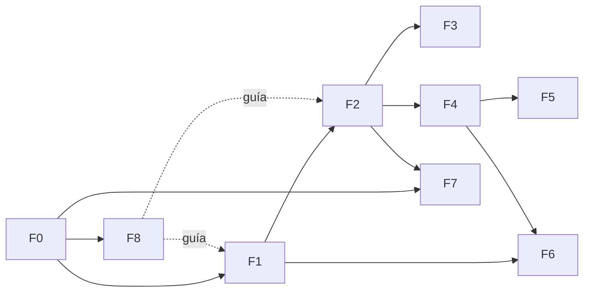

# Roadmap de Definición — Sistema de Gestión de Tickets

**Prueba Técnica · IATSAE**

> Este documento es un **meta-plan**: define *cómo, en qué orden y con qué entregables* vamos a **definir** el proyecto antes de escribir código de negocio. Todavía **no** contiene las épicas, el design system ni los linters finales — cada uno queda como **tarea con alcance** en su fase. Iteraremos sobre las "Decisiones abiertas" hasta cerrar la definición exacta.

| Campo | Valor |
|---|---|
| **Estado** | Borrador v0.1 — pendiente de tu revisión |
| **Fecha** | 2026-06-22 |
| **Modalidad** | Monorepo · Alcance libre (propuesta abierta) |
| **Jerarquía ágil** | Legenda → Épica → Historia de Usuario (HU) |
| **Regla de oro** | Nada se construye sin su `.md` de definición aprobado |

---

## 1. Visión del proyecto

Sistema de gestión de **tickets** (soporte / incidencias) con **backend protagonista** en Symfony y un **frontend de apoyo** en React. El valor técnico se concentra en arquitectura limpia, rendimiento (cache), procesamiento asíncrono y búsqueda; el frontend consume la API mediante **JWT**.

## 2. Stack y versiones

Núcleo **fijado** (obligatorio por el proyecto) y piezas **a confirmar** (se cierran en su fase).

| Capa | Tecnología | Versión | Estado |
|---|---|---|---|
| Lenguaje backend | PHP | 8.4 *(mín. 8.2 que exige Symfony 7.4)* | Fijada |
| Framework backend | Symfony LTS | 7.4 | Fijada |
| Autenticación | JWT (LexikJWTAuthenticationBundle) | — | Fijada |
| Cache | Redis | 7.x | Fijada |
| Mensajería / background | RabbitMQ (vía Symfony Messenger) | 4.x | Fijada |
| Búsqueda | Elasticsearch | 8.x / 9.x → **F5** | A confirmar |
| Lenguaje frontend | TypeScript | 5.x | Fijada |
| Librería frontend | React | 19 | Fijada |
| Runtime / build front | Node.js LTS + Vite | Node 24 LTS | Fijada |
| Contenerización | Docker + Docker Compose | — | Fijada |
| DevEx / IA | Claude Code (rules · agents · skills · hooks · MCP) | — | Fijada |
| Base de datos | PostgreSQL / MySQL → **F2** | — | A confirmar |

*Symfony 7.4 es la última LTS (soporte de bugs hasta nov-2028, seguridad hasta nov-2029). Referencias al final.*

## 3. Principios rectores

| Principio | Cómo se aplica |
|---|---|
| **SOLID** | Diseño de servicios y casos de uso; revisado en cada PR |
| **Arquitectura Hexagonal** (Ports & Adapters) | Dominio aislado de framework, DB, Redis, RabbitMQ y ES |
| **DDD táctico** | Bounded contexts, entidades, value objects, agregados |
| **CQRS ligero** | Separación lectura/escritura donde aporte (búsqueda, listados) |
| **12-Factor** | Config por entorno, reproducibilidad en Docker |
| **Conventional Commits + Trunk-based light** | Trazabilidad y CI predecible |

## 4. Estructura del monorepo (propuesta)

```text
prueba-tecnica-iatsae/
├── apps/
│   ├── api/                 # Backend Symfony 7.4 (hexagonal)
│   │   └── CLAUDE.md         # Rules del backend (anidado)
│   └── web/                 # Frontend React 19 + TS + Vite
│       └── CLAUDE.md         # Rules del frontend (anidado)
├── docs/                    # ← TODA la definición vive aquí (ver §6)
├── docker/                  # Dockerfiles, configs de servicios
├── .claude/                 # Configuración de Claude Code (F8)
│   ├── agents/              # Subagentes (revisor hexagonal, tests…)
│   ├── skills/              # Skills de scaffolding del dominio
│   ├── commands/            # Slash commands del equipo
│   ├── settings.json        # Commiteado: permisos + hooks compartidos
│   └── settings.local.json  # Gitignored: overrides personales
├── CLAUDE.md                # Rules raíz del proyecto
├── .mcp.json                # MCP servers del equipo (project-scoped)
├── docker-compose.yml       # Orquestación local completa
├── Makefile                 # Atajos: make up / make test / make lint
├── .env.example             # Variables de entorno documentadas
└── README.md                # Arranque en cualquier máquina
```

## 5. Modelo de fases

Cada fase produce uno o más `.md` en `docs/`. El orden refleja dependencias, no calendario.

| Fase | Nombre | Entregable principal | Depende de |
|---|---|---|---|
| **F0** | Fundaciones & entorno | `docs/00-vision.md`, `docs/01-glosario.md`, entorno Docker | — |
| **F1** | Producto & Ágil | `docs/product/` (legendas, épicas, HU) | F0 |
| **F2** | Arquitectura & Dominio | `docs/architecture/` + ADRs | F0, F1 |
| **F3** | Patrones de diseño | `docs/architecture/patterns.md` | F2 |
| **F4** | Contratos & Seguridad | `docs/api/openapi.yaml`, `docs/security.md` | F2 |
| **F5** | Servicios de plataforma | `docs/platform/` (Redis, RabbitMQ, ES) | F2, F4 |
| **F6** | Design System (front) | `docs/design-system/` | F1, F4 |
| **F7** | Calidad & DevEx | `docs/quality/` (linters, testing, CI/CD) | F0 |
| **F8** | DevEx con IA — Claude Code *(transversal)* | `docs/ai-devex/` (rules, agents, skills, hooks, MCP) | F0 |



---

## 6. Detalle de fases

### F0 · Fundaciones & entorno reproducible

- **Objetivo:** que el repo arranque en cualquier máquina con un solo comando y fijar el vocabulario común.
- **Entregables:** `docs/00-vision.md`, `docs/01-glosario.md`, `docker-compose.yml`, `Makefile`, `.env.example`, `README.md`.
- **Decisiones a tomar:** base de datos (PostgreSQL vs MySQL), gestor de dependencias front (npm/pnpm), nombre y licencia del repo.
- **Done cuando:** `make up` levanta API + web + Redis + RabbitMQ + ES + DB y el `README` documenta el arranque.

### F1 · Producto & Ágil  (Legenda → Épica → HU) — *en progreso*

- **Objetivo:** definir el backlog y las convenciones de producto.
- **Entregables:** `docs/product/backlog.md` (✅ v0.1) con **Legendas → Épicas → HU**, criterios de aceptación, **DoR/DoD**, estimación y **convención de mapeo a GitHub Issues**; materialización como issues (sub-issues + labels) por Claude Code.
- **Decisiones tomadas:** MVP *stack completo* · roles Cliente/Agente/Admin · backlog en **GitHub Issues**.
- **Done cuando:** el backlog del MVP está desglosado a HU estimables con criterios de aceptación y listo para crear los issues.

### F2 · Arquitectura & Dominio

- **Objetivo:** fijar la arquitectura hexagonal y el modelo de dominio.
- **Entregables:** diagrama **C4** (contexto/contenedores/componentes), mapa de **bounded contexts**, modelo de dominio (entidades, VOs, agregados), estructura de capas (`Domain`/`Application`/`Infrastructure`), **ADRs** iniciales.
- **Decisiones a tomar:** límites de contextos (¿Ticketing, Identity, Search, Notifications?), estilo de IDs (UUID vs ULID), ORM (Doctrine) vs persistencia a medida.
- **Done cuando:** un caso de uso de ejemplo está mapeado de extremo a extremo (puerto → adaptador) en el `.md`.

### F3 · Catálogo de patrones de diseño (casos concretos)

- **Objetivo:** documentar **cuándo y por qué** usar cada patrón, con casos reales del dominio de tickets.
- **Entregables:** `patterns.md` con tabla *Patrón → Caso concreto → Justificación → Alternativa descartada*.
- **Candidatos a documentar:** Repository, Factory, Strategy (reglas de SLA/prioridad), Command/Handler (Messenger), Decorator (cache), Adapter (ES/Redis), Observer/Event (notificaciones), Specification (filtros de búsqueda).
- **Done cuando:** cada patrón listado tiene un caso concreto y un anti-caso (cuándo NO usarlo).

### F4 · Contratos de API & Seguridad

- **Objetivo:** definir el contrato HTTP y el flujo de autenticación/autorización.
- **Entregables:** `openapi.yaml` (recursos, errores, paginación), `security.md` (flujo **JWT**, refresh, expiración, **RBAC** por rol).
- **Decisiones a tomar:** versionado de API (URL vs header), refresh tokens (sí/no), permisos por recurso, rate limiting.
- **Done cuando:** los endpoints del MVP están en OpenAPI y el flujo JWT está diagramado.

### F5 · Servicios de plataforma (Redis · RabbitMQ · Elasticsearch)

- **Objetivo:** definir estrategias de cache, asincronía y búsqueda.
- **Entregables:** `platform/redis.md` (qué se cachea, claves, TTL, invalidación), `platform/rabbitmq.md` (qué va a background: notificaciones, indexado, reportes; colas, reintentos, DLQ), `platform/elasticsearch.md` (índices, mapping, sincronía DB↔ES, qué campos se buscan).
- **Decisiones a tomar:** versión exacta de ES, política de invalidación de cache, idempotencia de workers, estrategia de reindexado.
- **Done cuando:** cada servicio tiene un caso de uso definido (no genérico) y su estrategia de fallo.

### F6 · Design System (frontend React)

- **Objetivo:** definir el lenguaje visual y de componentes del front.
- **Entregables:** `design-system/` con **tokens** (color, tipografía, espaciado), inventario de **componentes**, principios de **accesibilidad** (WCAG AA), patrón de consumo de API + manejo de JWT en cliente.
- **Decisiones a tomar:** librería base (shadcn/ui, MUI, propia), gestión de estado servidor (TanStack Query), tema claro/oscuro, alcance de Storybook.
- **Done cuando:** existen tokens base y ≥1 componente documentado como referencia.

### F7 · Calidad & DevEx (linters, testing, CI/CD)

- **Objetivo:** fijar herramientas y **niveles de rigor** para backend y frontend.
- **Entregables:** `quality/linting.md`, `quality/testing.md`, `quality/ci-cd.md`, configs versionadas.
- **Propuesta inicial de linters y nivel** *(a confirmar contigo)*:

| Ámbito | Herramienta | Nivel propuesto |
|---|---|---|
| PHP — análisis estático | PHPStan | Nivel **9** (máx) + reglas Symfony |
| PHP — estilo | PHP-CS-Fixer / ECS | PSR-12 + reglas Symfony, `--dry-run` en CI |
| PHP — modernización | Rector | Set PHP 8.4 + Symfony, en CI (check) |
| JS/TS — análisis | ESLint | `eslint-config-airbnb` o `typescript-eslint` *strict-type-checked* |
| TS — tipado | tsconfig | `"strict": true` + `noUncheckedIndexedAccess` |
| JS/TS — formato | Prettier | Config compartida, check en CI |
| Commits | Commitlint + Husky | Conventional Commits, bloqueante |

- **Testing propuesto:** PHPUnit (unit + integración), Behat o API tests para casos de uso; Vitest + Testing Library (front); meta de cobertura a acordar.
- **Done cuando:** linters fallan el build ante violación y existe pipeline mínima verde.

### F8 · DevEx con IA — Claude Code (transversal)

- **Objetivo:** estandarizar cómo el equipo desarrolla con Claude Code, con reglas, subagentes, skills, automatizaciones y permisos versionados en el repo.
- **Entregables (`docs/ai-devex/` + raíz):**
  - `CLAUDE.md` raíz + anidados en `apps/api` y `apps/web` — **rules**: arquitectura hexagonal, SOLID, estructura de capas, comandos `make`, convención de commits.
  - `.claude/agents/` — **subagentes**: revisor de arquitectura (verifica hexagonal/SOLID), ejecutor de tests, revisor de seguridad, linter PHP/TS.
  - `.claude/skills/` — **skills** de scaffolding del dominio: crear caso de uso hexagonal, nuevo endpoint, plantilla de HU, generar ADR.
  - `.claude/commands/` — **slash commands** del equipo.
  - `.claude/settings.json` — **hooks** (`PostToolUse`: PHP-CS-Fixer/Prettier al editar; `PreToolUse`: bloquear comandos peligrosos) y modelo de **permisos** (allow / ask / deny).
  - `.mcp.json` — **MCP servers** del equipo (credenciales en `settings.local.json`, gitignored).
- **Decisiones a tomar:** qué subagentes y skills priorizamos; qué hooks son bloqueantes vs informativos; qué comandos auto-aprobamos; qué se commitea vs `.gitignore`; modelo por defecto.
- **Done cuando:** existe `CLAUDE.md` con reglas y comandos, ≥1 subagente, ≥1 skill y ≥1 hook operativos, permisos definidos y `.gitignore` cubriendo `settings.local.json` y la memoria automática.

---

## 7. Convenciones de documentación

| Tema | Convención |
|---|---|
| Nombres de archivo | `kebab-case.md`, prefijo numérico cuando hay orden (`00-`, `01-`) |
| Historias de Usuario | `Como <rol> quiero <acción> para <beneficio>` + criterios de aceptación (Gherkin) |
| Decisiones de arquitectura | Formato **ADR** (contexto, decisión, consecuencias) |
| Commits | Conventional Commits (`feat:`, `fix:`, `docs:`, `chore:`…) |
| Diagramas | Mermaid embebido en `.md` (render directo en el repo) |

## 8. Decisiones abiertas (a iterar contigo)

**Resueltas (2026-06-22):**

1. ✅ **Alcance del MVP:** *stack completo* — CRUD de tickets + JWT + RabbitMQ + Elasticsearch + Redis.
2. ✅ **Roles de usuario:** Cliente · Agente · Admin (RBAC de 3 niveles).
3. ✅ **Base de datos:** PostgreSQL.
4. ✅ **Seguimiento ágil:** backlog en `docs/product/backlog.md` materializado como **GitHub Issues** (legendas/épicas/HU vía sub-issues + labels), creados por Claude Code.

**Resueltas (continuación):**

5. ✅ **Bounded contexts:** Identity · Ticketing (núcleo) · Search · Notifications, comunicados por eventos (ADR 0002).
6. ✅ **Design System:** MUI con tema claro/oscuro (índigo), TanStack Query y Storybook.
7. ✅ **Niveles de linter:** estrictos desde el día 1 — PHPStan 9 + TS strict + ESLint type-checked.
8. ✅ **Cobertura de tests:** 80% bloqueante en dominio/aplicación; unit + integración + E2E.
9. ✅ **Claude Code — permisos:** modelo amplio (auto salvo destructivos), entorno solo local.
10. ✅ **Claude Code — alcance:** 4 subagentes, 4 skills, MCP (GitHub/PostgreSQL/Elasticsearch/GlitchTip).

## 9. Próximos pasos inmediatos

1. Revisas la documentación de definición (F0–F8); todas las decisiones de §8 están cerradas.
2. Claude Code materializa el backlog como **GitHub Issues** (milestone `MVP` + Project + sub-issues).
3. Arranca la **implementación**: entorno Docker (incl. GlitchTip), esqueleto hexagonal y primer caso de uso end-to-end.
4. Se materializan los archivos `.claude/` (agents, skills, hooks, MCP) definidos en F8.

## 10. Referencias de versiones

- Symfony 7.4 LTS y calendario — https://symfony.com/releases/7.4
- Symfony releases / EOL — https://endoflife.date/symfony
- PHP versiones soportadas — https://www.php.net/supported-versions.php
- Node.js LTS — https://nodejs.org/en/about/previous-releases
- Claude Code · directorio `.claude` — https://code.claude.com/docs/en/claude-directory
- Claude Code · settings y permisos — https://code.claude.com/docs/en/settings
- Claude Code · skills — https://code.claude.com/docs/en/skills
- Claude Code · hooks — https://code.claude.com/docs/en/hooks
