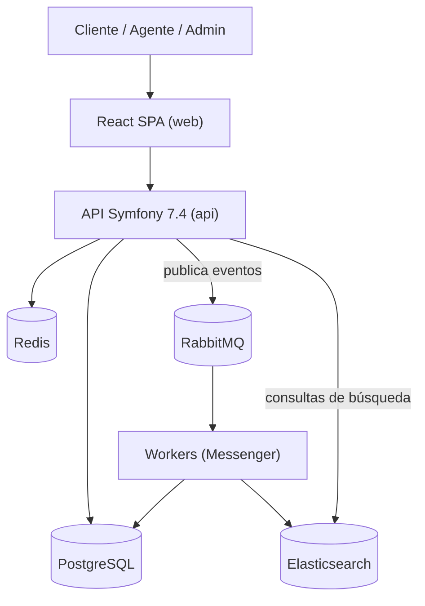
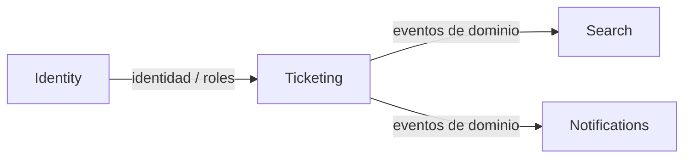
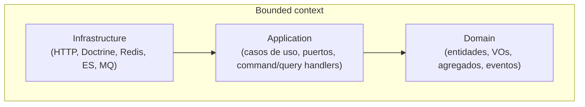

# Arquitectura y Dominio — Sistema de Gestión de Tickets

**Prueba Técnica · IATSAE** · Fase **F2 · Arquitectura & Dominio**

| Campo | Valor |
|---|---|
| **Estado** | Estable · v1.0 |
| **Fecha** | 2026-06-26 |
| **Decisiones** | [ADR 0001–0008](adr/README.md) |
| **Relacionados** | [`ROADMAP.md`](../../ROADMAP.md) · [`docs/01-glosario.md`](../01-glosario.md) |

## 1. Estilo arquitectónico

- **Arquitectura hexagonal** (Puertos y Adaptadores): el dominio no conoce framework, ORM ni infraestructura.
- **DDD táctico**: entidades, value objects, agregados y eventos de dominio por contexto.
- **Monolito modular**: cada *bounded context* es un módulo autónomo con sus tres capas.
- **CQRS ligero**: comandos para escritura; consultas optimizadas para lectura y búsqueda.

## 2. Vista C4 — Contenedores



## 3. Bounded contexts

Cuatro contextos con un *context map* explícito.

| Contexto | Responsabilidad | Relación |
|---|---|---|
| **Identity** | Usuarios, autenticación (JWT) y roles (RBAC) | *Upstream*: provee identidad al resto |
| **Ticketing** | Núcleo: ciclo de vida, asignación, comentarios | *Core domain*; emite eventos |
| **Search** | Indexado y búsqueda de tickets (Elasticsearch) | *Downstream*: consume eventos de Ticketing |
| **Notifications** | Notificaciones async ante cambios | *Downstream*: consume eventos de Ticketing |



La comunicación entre contextos es por **eventos de dominio** (desacople), no por llamadas directas.

## 4. Capas y regla de dependencia



**Regla:** las dependencias apuntan hacia adentro. `Domain` no importa nada externo; `Application` define **puertos** (interfaces); `Infrastructure` los implementa (**adaptadores**). El framework (Symfony) y el ORM (Doctrine) viven solo en `Infrastructure`.

## 5. Estructura de carpetas (backend)

```text
apps/api/src/
├── Shared/                  # Kernel, buses, VOs y utilidades comunes
│   ├── Domain/
│   ├── Application/          # CommandBus, QueryBus, EventBus (puertos)
│   └── Infrastructure/
├── Identity/
│   ├── Domain/              # User, Email, Role, UserId
│   ├── Application/         # Register, Login, casos de uso
│   └── Infrastructure/      # Controllers, Doctrine, JWT
├── Ticketing/
│   ├── Domain/              # Ticket (agregado), Comment, VOs, eventos
│   ├── Application/         # Commands/Queries + Handlers + puertos
│   └── Infrastructure/      # Controllers, DoctrineTicketRepository, cache
├── Search/
│   ├── Domain/ Application/ Infrastructure/   # Índice y cliente ES
└── Notifications/
    └── Domain/ Application/ Infrastructure/   # Consumers, notificadores
```

## 6. Modelo de dominio (Ticketing)

**Agregado raíz: `Ticket`**

| Elemento | Tipo | Detalle |
|---|---|---|
| `TicketId` | Value Object | UUID v7 (ordenable) |
| `title`, `description` | atributos | validados en el dominio |
| `TicketStatus` | Value Object | `open · in_progress · resolved · closed · reopened` con transiciones válidas |
| `Priority` | Value Object | `low · medium · high · urgent` |
| `Category` | Value Object | clasificación temática |
| `requesterId` | `UserId` | cliente que lo crea |
| `assigneeId` | `UserId?` | agente responsable (opcional) |
| `comments` | `Comment[]` | entidad hija |
| eventos | Domain Events | `TicketCreated`, `TicketStatusChanged`, `TicketAssigned`, `TicketEdited`, `TicketCommented` |

**Invariantes** (garantizadas por el agregado):

- Solo se permiten transiciones de estado válidas; una inválida lanza excepción de dominio.
- Un ticket solo puede asignarse a un usuario con rol Agente.
- Crear o cambiar el ticket registra el evento de dominio correspondiente.

## 7. CQRS

| Lado | Ejemplos | Camino |
|---|---|---|
| **Comandos** (escritura) | `CreateTicket`, `ChangeTicketStatus`, `AssignTicket`, `AddComment` | Controller → CommandBus → Handler → Domain → Repositorio (port) |
| **Consultas** (lectura) | `GetTicket`, `ListTickets`, `SearchTickets` | Controller → QueryBus → Handler → modelo de lectura (Doctrine/Elasticsearch/Redis) |

La búsqueda (`SearchTickets`) lee del índice de Elasticsearch, no del modelo de escritura.

## 8. Flujo de un caso de uso — *Crear ticket*

```mermaid
sequenceDiagram
    participant C as Cliente (SPA)
    participant Ctrl as TicketController (Infra)
    participant Bus as CommandBus (doctrine_transaction)
    participant H as CreateTicketHandler (App)
    participant T as Ticket (Domain)
    participant Repo as TicketRepository (port→Doctrine)
    participant OB as EventOutbox (port→Doctrine)
    participant Relay as ticketing:outbox:relay
    participant MQ as RabbitMQ

    C->>Ctrl: POST /api/v1/tickets (JWT)
    Ctrl->>Bus: CreateTicketCommand
    Bus->>H: handle() — abre transacción
    H->>T: Ticket::create(...)
    T-->>H: registra TicketCreated
    H->>Repo: save(ticket)
    H->>OB: add(TicketCreated)
    Note over Bus,OB: ticket y evento en la MISMA transacción → commit atómico
    Ctrl-->>C: 201 Created (TicketId)
    Relay->>OB: SELECT pendientes (FOR UPDATE SKIP LOCKED)
    Relay->>MQ: publica TicketCreated (+OutboxIdStamp) y marca published_at
    Note over MQ: Workers indexan (Search) y notifican (Notifications); dedupe por message_id
```

El request HTTP responde sin esperar al indexado ni a la notificación. El evento se persiste en el outbox dentro de la misma transacción que el ticket (sin pérdida) y el relay lo publica después; ver [ADR 0008](adr/0008-outbox-transaccional-ticketing.md).

## 9. Decisiones de arquitectura

Registradas como ADR en [`adr/`](adr/README.md):

1. ADR 0001 — Arquitectura hexagonal + DDD + monolito modular
2. ADR 0002 — Cuatro bounded contexts y comunicación por eventos
3. ADR 0003 — Identificadores UUID v7
4. ADR 0004 — Dominio puro desacoplado de Doctrine
5. ADR 0005 — CQRS ligero (comandos/consultas)
6. ADR 0006 — Refresh token en cookie HttpOnly (SameSite=Strict)
7. ADR 0007 — Indexado asíncrono y búsqueda desacoplada
8. ADR 0008 — Outbox transaccional para los eventos de Ticketing

## 10. Pendiente de iterar

- Detallar el modelo de dominio de Identity, Search y Notifications al nivel de Ticketing
  (este documento se centra en el *core*).
