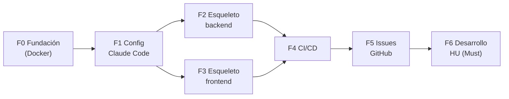

# Plan de Implementación — Hoja de ruta para Claude Code

**Prueba Técnica · IATSAE**

> **Principio rector:** primero se **sientan las bases**, luego se desarrollan las HU. No se arranca el desarrollo de funcionalidades (Fase 6) hasta que las bases (Fases 0–4) estén verdes. La definición completa vive en [`docs/`](.) y es la fuente de verdad.

| Campo | Valor |
|---|---|
| **Estado** | Borrador v0.1 |
| **Fecha** | 2026-06-22 |
| **Ya hecho** | Definición F0–F8 · backlog rico (38 HU) · `CLAUDE.md` (raíz + apps) |
| **Primer corte** | 23 HU `Must` |

## Orden de fases

---

## Fase 0 · Fundación del repositorio (Docker)

**Objetivo:** que el repo arranque en cualquier máquina con un comando, sin toolchain local.

- [ ] `git init` + `.gitignore` (incluir `.claude/settings.local.json`, `vendor/`, `node_modules/`, `.env`, `var/`).
- [ ] Estructura monorepo: `apps/api`, `apps/web`, `docker/`.
- [ ] Dockerfiles: `api` (PHP 8.4-fpm), `web` (Node 24).
- [ ] `docker-compose.yml`: `api`, `web`, `postgres`, `redis`, `rabbitmq`, `elasticsearch` (8.x), `glitchtip`.
- [ ] `Makefile`: `up`, `down`, `test`, `lint`, `seed`, `sh`.
- [ ] `.env.example` con todas las variables; `README.md` de arranque.

**Listo cuando:** `make up` deja todos los servicios *healthy*. (Ref: HU-L7-E1-01)

## Fase 1 · Bases de DevEx con IA (Claude Code)

**Objetivo:** que Claude Code trabaje con sus reglas, agentes, skills y automatizaciones desde el inicio.

- [x] `CLAUDE.md` raíz + `apps/api` + `apps/web`.
- [ ] `.claude/settings.json`: permisos (allow amplio · deny destructivos) + hooks (`PostToolUse` formato/lint · `PreToolUse` guardarraíl).
- [ ] `.claude/agents/`: `revisor-arquitectura`, `revisor-seguridad`, `tests`, `docs-adr`.
- [ ] `.claude/skills/`: `crear-caso-uso-hexagonal`, `crear-endpoint`, `hu-a-issue`, `generar-adr`.
- [ ] `.mcp.json`: GitHub · PostgreSQL · Elasticsearch · GlitchTip.

**Listo cuando:** los hooks se ejecutan al editar y los subagentes/skills son invocables. (Ref: `docs/ai-devex/overview.md`, HU-L7-E3-01)

## Fase 2 · Esqueleto del backend (walking skeleton)

**Objetivo:** arquitectura hexagonal montada y validada con un flujo mínimo end-to-end.

- [ ] Symfony 7.4 en `apps/api`.
- [ ] Módulos por contexto (`Identity`, `Ticketing`, `Search`, `Notifications`, `Shared`) con capas `Domain`/`Application`/`Infrastructure`.
- [ ] Buses Command/Query/Event (Messenger); conexiones Doctrine (PostgreSQL), Redis, RabbitMQ, Elasticsearch, JWT (Lexik RS256).
- [ ] Calidad: PHPStan 9, CS-Fixer, Rector, PHPUnit configurados.
- [ ] **Walking skeleton:** un endpoint de health + un caso de uso trivial que recorra puerto → adaptador.

**Listo cuando:** el esqueleto compila, pasa PHPStan 9 y un test de humo en verde. (Ref: `docs/architecture/`)

## Fase 3 · Esqueleto del frontend

**Objetivo:** app React montada con design system y Storybook.

- [ ] Vite + React 19 + TS `strict` en `apps/web`.
- [ ] MUI + tema claro/oscuro índigo · TanStack Query · React Router · `apiClient`.
- [ ] `AuthProvider` + `RequireAuth` (base).
- [ ] Storybook 10 + addons (a11y, themes) según `storybook-spec.md`; foundations + 1 componente.
- [ ] Calidad: ESLint type-checked, Prettier, Vitest, Playwright.

**Listo cuando:** `npm run dev` y `npm run storybook` arrancan; lint/tests en verde. (Ref: `docs/design-system/`)

## Fase 4 · CI/CD y guardarraíles

**Objetivo:** calidad automatizada bloqueante.

- [ ] GitHub Actions: jobs `backend`, `frontend`, `e2e`.
- [ ] Gates: lint + análisis estático + tests + cobertura **≥ 80%**.
- [ ] Pre-commit: captainhook/GrumPHP + lint-staged + commitlint.

**Listo cuando:** un PR con violación falla y se exige pipeline verde para *merge*. (Ref: `docs/quality/ci-cd.md`)

## Fase 5 · Materializar el backlog en GitHub

**Objetivo:** issues listos para ejecutar.

- [ ] Milestone `MVP` + Project "Tickets MVP".
- [ ] Crear legendas → épicas → HU como issues (sub-issues + labels) desde `docs/product/`.

**Listo cuando:** las HU `Must` están en GitHub. (Ref: `docs/product/backlog.md`)

## Fase 6 · Desarrollo de las HU (primer corte: 23 Must)

**Objetivo:** implementar el MVP siguiendo el backlog. **Solo arranca cuando F0–F4 están verdes.**

- Orden por dependencias: **L1** Identity (auth) → **L2** Ticketing (núcleo) → **L3/L4/L5** Search/Async/Cache → **L6** Frontend → **L7** (seeds + CI restante).
- Por cada HU: rama de *feature*, **TDD** (test primero), cumplir criterios de aceptación, pasar el **DoD**, PR revisado (subagentes de arquitectura/seguridad).

**Listo cuando:** las 23 HU `Must` están completas, con cobertura ≥ 80% y pipeline verde.

---

## Regla de avance

Cada fase tiene un criterio de "listo" verificable. No se pasa a la siguiente sin cumplirlo, y **no se tocan features (F6) sin las bases (F0–F4)**. Las `Should`/`Could` quedan para la 2ª iteración (incluidas las notificaciones por SMTP real).
