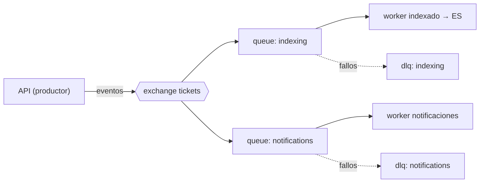

# RabbitMQ — Procesamiento Asíncrono

**Prueba Técnica · IATSAE** · Fase **F5 · Servicios de plataforma**

| Campo | Valor |
|---|---|
| **Estado** | Estable · v1.0 |
| **Fecha** | 2026-06-22 |
| **Abstracción** | Symfony Messenger (transporte AMQP) |
| **Topología** | Una cola por propósito + DLQ |

## 1. Rol

Sacar del request HTTP todo lo que no necesita ser síncrono: **indexar en Elasticsearch** y **notificar**. El request responde tras persistir y publicar el evento.

## 2. Eventos de dominio publicados

| Evento | Se emite al… |
|---|---|
| `TicketCreated` | Crear un ticket |
| `TicketStatusChanged` | Cambiar el estado |
| `TicketAssigned` | Asignar un agente |
| `TicketCommented` | Añadir un comentario |

## 3. Topología

| Cola | Consume | Acción |
|---|---|---|
| `indexing` | `TicketCreated`, `TicketStatusChanged`, `TicketAssigned`, `TicketCommented` | (Re)indexar el ticket en Elasticsearch |
| `notifications` | `TicketAssigned`, `TicketStatusChanged` | Notificar a agente/cliente (email vía SMTP + registro) |

## 4. Reintentos y DLQ

- Política de reintentos con **backoff** exponencial (p. ej. 3 intentos: 1 s, 5 s, 25 s).
- Tras agotar los reintentos, el mensaje pasa a la **dead-letter queue** correspondiente para inspección manual.
- Las DLQ se monitorizan; un mensaje en DLQ es una alerta, no una pérdida.

## 5. Idempotencia

- Los consumidores son **idempotentes**: reprocesar `TicketCreated` no duplica el documento en ES ni la notificación.
- Se logra usando el `TicketId` como identificador determinista (upsert en ES, deduplicación en notificaciones).

## 6. Workers

- Se ejecutan con `messenger:consume indexing notifications` en contenedores dedicados.
- Escalables horizontalmente (varios consumidores por cola).
- Reinicio controlado (`--limit`, `--time-limit`) para evitar fugas de memoria.

## 7. Pendiente de iterar

- Confirmar número de reintentos y tiempos de backoff.
- Decidir prioridad entre colas si se observa contención.
- Definir alertas sobre profundidad de cola y mensajes en DLQ.
