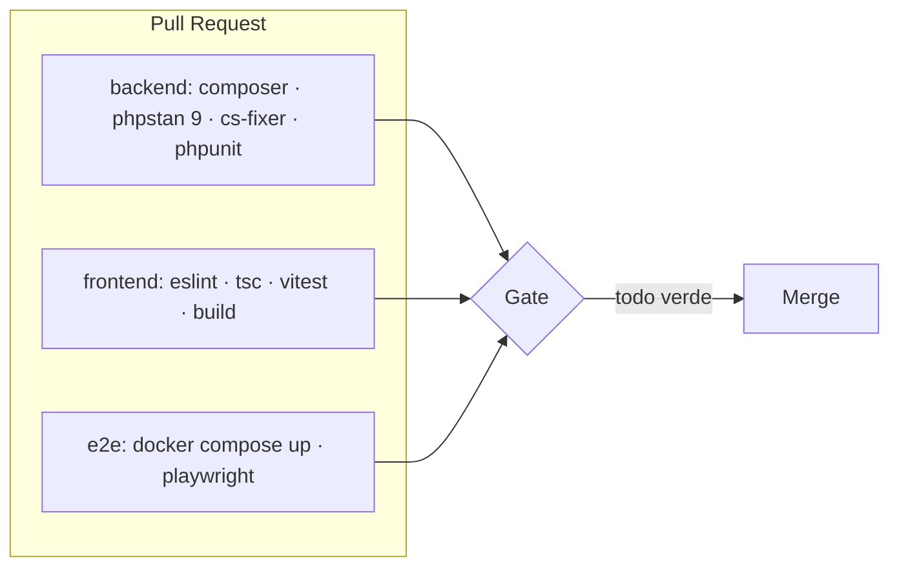

# CI/CD — Integración y Entrega Continua

**Prueba Técnica · IATSAE** · Fase **F7 · Calidad & DevEx**

| Campo | Valor |
|---|---|
| **Estado** | Estable · v1.0 |
| **Fecha** | 2026-06-22 |
| **Plataforma** | GitHub Actions |
| **Gate** | Todo verde (lint + estático + tests + cobertura) para fusionar |

## 1. Disparadores

| Evento | Workflow |
|---|---|
| Pull Request a `main` | Validación completa (lint, análisis, tests, build) |
| Push a `main` | Validación + build de imágenes Docker |

## 2. Jobs

| Job | Pasos |
|---|---|
| **backend** | Instala dependencias (cache), PHPStan nivel 9, CS-Fixer `--dry-run`, PHPUnit + cobertura |
| **frontend** | Instala deps (cache), ESLint, `tsc --noEmit`, Vitest + cobertura, build de producción |
| **e2e** | Levanta el stack con Docker Compose y ejecuta Playwright sobre el flujo principal |

## 3. Reglas de calidad en el pipeline

- **Cobertura bloqueante:** 80% en dominio/aplicación (ver [`testing.md`](testing.md)).
- **Cero violaciones** de linters/análisis estático.
- **Commits convencionales** verificados.
- Caché de dependencias (`composer`, `npm`) para acelerar.

## 4. Entrega (CD)

- En `main`, se construyen las **imágenes Docker** de `api` y `web` y se etiquetan.
- Publicación en un registry (GitHub Container Registry) — *opcional para el MVP*.
- Despliegue automático: fuera del alcance del MVP; el `docker-compose` permite ejecución local equivalente.

## 5. Branching

- **Trunk-based ligero:** ramas cortas de *feature* → PR → `main`.
- PR con revisión y pipeline verde como requisito de *merge*.

## 6. Pendiente de iterar

- Confirmar registry y si se incluye despliegue real.
- Definir matriz de versiones (PHP/Node) si se quiere probar más de una.
- Decidir publicación de reportes (cobertura, Playwright) como artefactos o comentarios en el PR.
