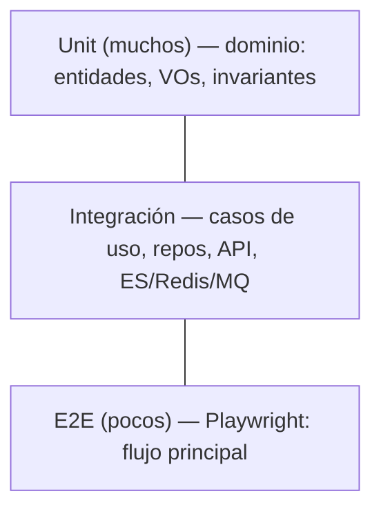

# Estrategia de Testing

**Prueba Técnica · IATSAE** · Fase **F7 · Calidad & DevEx**

| Campo | Valor |
|---|---|
| **Estado** | Borrador v0.1 |
| **Fecha** | 2026-06-22 |
| **Cobertura** | **80% bloqueante** en dominio + aplicación |
| **Niveles** | Unit · Integración · E2E |

## 1. Pirámide de tests

## 2. Backend (PHP)

| Nivel | Herramienta | Qué se prueba |
|---|---|---|
| **Unit** | PHPUnit | Dominio: invariantes del agregado, transiciones de estado, value objects (sin infraestructura) |
| **Integración** | PHPUnit + servicios reales en Docker | Casos de uso end-to-end, repositorios Doctrine, indexado ES, publicación en RabbitMQ |
| **API** | PHPUnit (cliente HTTP) | Endpoints: códigos, contrato, RBAC |

- Base de datos de test en PostgreSQL (contenedor dedicado), reiniciada por test/suite.
- Los puertos se sustituyen por *test doubles* en unit; reales en integración.

## 3. Frontend (React)

| Nivel | Herramienta | Qué se prueba |
|---|---|---|
| **Unit / componente** | Vitest + Testing Library | Componentes del design system, hooks, lógica de vistas |
| **E2E** | Playwright | Flujo principal: login → crear ticket → buscar → cambiar estado |

## 4. Cobertura

- Umbral **80% bloqueante** en `Domain` y `Application` (la lógica crítica).
- `Infrastructure` con exigencia menor (su valor se cubre en integración/E2E).
- Reporte de cobertura publicado como artefacto en CI.

## 5. Buenas prácticas

- Patrón **AAA** (Arrange–Act–Assert); un concepto por test.
- Tests **deterministas** (sin dependencias de reloj/red reales; relojes y colas controlados).
- **Fixtures/factories** para datos de prueba reproducibles.
- Nombres descriptivos que documentan el comportamiento esperado.

## 6. Pendiente de iterar

- Elegir herramienta de API testing (PHPUnit puro vs Behat/API Platform testing).
- Definir el set mínimo de escenarios E2E para la demo.
- Confirmar estrategia de *seeding* para E2E.
